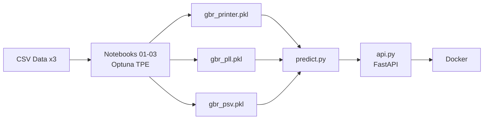

# Hyperparameter Optimization

Grid Search, Random Search, and Bayesian Optimization (Optuna TPE) applied to three engineering regression problems with Gradient Boosting. The gap between methods widens dramatically as the search space grows from 5 to 8 dimensions.

**Key result:** Optuna TPE hit CV R2=0.932 at eval 18. Random Search needed eval 27. Grid Search needed eval 50. Same 100-eval budget. 2.8x fewer evaluations to reach the engineering target.

## Results

| Dataset | Rows | Dims | Target | Best R2 | RMSE | Evals to Target |
|---|---|---|---|---|---|---|
| 3D Printer Quality | 5,000 | 5 | print_quality | **0.9742** | 0.0295 | Optuna: 15 trials |
| PLL Loop Filter | 5,000 | 5 | lock_time_us | **0.9662** | 4.9837 | Optuna: eval 11, Grid: eval 25 |
| Post-Silicon Validation | 3,000 | 8 | timing_slack_ps | **0.9436** | 6.96 ps | Optuna: eval 18, Grid: eval 50 |

## HPO Strategy Comparison (Post-Silicon, 8-dim)

| Method | Final R2 | RMSE | Evals to Target (0.932) |
|---|---|---|---|
| Grid Search (8-dim subsampled) | 0.9420 | 7.0588 | eval 50 |
| Random Search (8-dim uniform) | 0.9395 | 7.2122 | eval 27 |
| Optuna TPE (8-dim adaptive) | **0.9436** | **6.9628** | **eval 18** |

## Repository Structure

```
010_hyperparameter_optimization/
├── assets/
│   ├── proj1_printer_3d_hp_landscape.png
│   ├── proj1_printer_convergence_comparison.png
│   ├── proj1_printer_cross_validation.png
│   ├── proj1_printer_flowchart.png
│   ├── proj1_printer_hpo_comparison.png
│   ├── proj1_printer_model_heatmap.png
│   ├── proj1_printer_optuna_history.png
│   ├── proj1_printer_optuna_insights.png
│   ├── proj1_printer_search_comparison.png
│   ├── proj1_printer_search_landscape.png
│   ├── proj2_pll_3d_design_space.png
│   ├── proj2_pll_flowchart.png
│   ├── proj2_pll_hpo_comparison.png
│   ├── proj2_pll_hpo_metrics.json
│   ├── proj2_pll_hpo_summary.csv
│   ├── proj2_pll_optimization.png
│   ├── proj2_pll_param_importance.png
│   ├── proj2_pll_search_race.gif
│   ├── proj2_pll_target_payload.json
│   ├── proj2_pll_target_summary.csv
│   ├── proj3_psv_eda.png
│   ├── proj3_psv_hpo_comparison.png
│   ├── proj3_psv_hpo_metrics.json
│   ├── proj3_psv_hpo_summary.csv
│   ├── proj3_psv_param_importance.png
│   ├── proj3_psv_search_race.gif          # LinkedIn animated search-race GIF
│   ├── proj3_psv_target_payload.json
│   └── proj3_psv_target_summary.csv
├── data/
│   ├── 3d_printer_quality.csv             # 5,000 rows - nozzle_temp, speed, etc.
│   ├── pll_loop_filter.csv                # 5,000 rows - charge_pump, loop_bw, etc.
│   └── post_silicon_timing.csv            # 3,000 rows - vt_sigma, leff_nm, etc.
├── deploy/
│   ├── Dockerfile
│   └── docker-compose.yml
├── docs/
│   ├── Hyperparameter_Optimization_Report.html
│   ├── Hyperparameter_Optimization_Report.pdf
│   └── carousel.pdf                       # LinkedIn carousel
├── models/
│   ├── gbr_printer.pkl                    # Optuna-tuned GBR (3D printer)
│   ├── gbr_pll.pkl                        # Optuna-tuned GBR (PLL)
│   └── gbr_psv.pkl                        # Optuna-tuned GBR (post-silicon)
├── notebooks/
│   ├── 01_hpo_3d_printer.ipynb            # Grid/Random/Bayesian on printer data
│   ├── 02_hpo_pll_loop_filter.ipynb       # Grid/Random/Bayesian on PLL data
│   └── 03_hpo_post_silicon_validation.ipynb  # 8-dim HPO with fANOVA analysis
├── src/
│   ├── train.py                           # Optuna-tuned GBR for both datasets
│   ├── predict.py                         # Batch inference
│   └── api.py                             # FastAPI /predict endpoint
├── tests/
│   └── test_model.py                      # 4 automated tests
├── requirements.txt
├── LICENSE
└── README.md
```

## Architecture



## Key Insights

- **5-dim space:** All three methods find near-identical final R2. Optuna still converges 2x faster.
- **8-dim space:** Grid is forced to subsample a 1,152-point lattice blindly. Optuna's TPE uses every past result to update its surrogate model, reaching the target 2.8x faster.
- **fANOVA analysis:** learning_rate accounts for 82.8% of objective variance in the 8-dim post-silicon space. Optuna's log-scale LR sampling exploits this directly.
- **Production pipeline:** Optuna-tuned GBR served via FastAPI + Docker.

## Getting Started

```bash
git clone https://github.com/AIML-Engineering-Lab/010_hyperparameter_optimization.git
cd 010_hyperparameter_optimization
pip install -r requirements.txt

# Train (runs Optuna on both datasets)
python src/train.py

# Predict
python src/predict.py

# Tests
python tests/test_model.py

# API
uvicorn src.api:app --reload
```

## Tech Stack

| Tool | Version | Purpose |
|---|---|---|
| Python | 3.12 | Core language |
| scikit-learn | 1.5+ | GradientBoostingRegressor, pipelines |
| Optuna | 3.x | Bayesian hyperparameter optimization (TPE) |
| FastAPI | 0.100+ | REST API serving |
| Docker | 24+ | Containerized deployment |
| Matplotlib | 3.x | Visualization and animated GIFs |
| Pillow | 10.x | GIF post-processing |

## License

MIT

