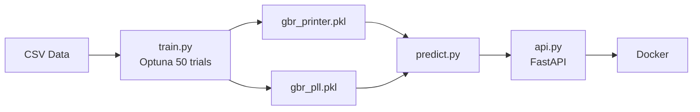

# Hyperparameter Optimization

Grid Search, Random Search, and Bayesian Optimization (Optuna) applied to two regression problems with Gradient Boosting — 3D Printer Quality and PLL Loop Filter.

## Results

| Dataset | Rows | Target | R² | RMSE | Optuna Trials |
|---|---|---|---|---|---|
| 3D Printer Quality | 5,000 | print_quality | **0.9742** | 0.0295 | 50 |
| PLL Loop Filter | 5,000 | lock_time_us | **0.9662** | 4.9837 | 50 |

## Repository Structure

```
010_hyperparameter_optimization/
├── assets/
│   ├── proj1_printer_3d_hp_landscape.png      # 3D hyperparameter landscape
│   ├── proj1_printer_convergence_comparison.png
│   ├── proj1_printer_cross_validation.png
│   ├── proj1_printer_flowchart.png            # Project 1 flowchart
│   ├── proj1_printer_hpo_comparison.png
│   ├── proj1_printer_model_heatmap.png
│   ├── proj1_printer_optuna_history.png
│   ├── proj1_printer_optuna_insights.png
│   ├── proj1_printer_search_comparison.png
│   ├── proj1_printer_search_landscape.png
│   ├── proj2_pll_3d_design_space.png          # 3D PLL design space
│   ├── proj2_pll_flowchart.png                # Project 2 flowchart
│   ├── proj2_pll_hpo_comparison.png
│   ├── proj2_pll_optimization.png
│   └── proj2_pll_param_importance.png
├── data/
│   ├── 3d_printer_quality.csv                 # 5,000 rows — nozzle_temp, speed, etc.
│   └── pll_loop_filter.csv                    # 5,000 rows — charge_pump, loop_bw, etc.
├── deploy/
│   ├── Dockerfile
│   └── docker-compose.yml
├── docs/
│   ├── Hyperparameter_Optimization_Report.html
│   └── Hyperparameter_Optimization_Report.pdf
├── models/
│   ├── gbr_printer.pkl                        # Optuna-tuned GBR (printer)
│   └── gbr_pll.pkl                            # Optuna-tuned GBR (PLL)
├── notebooks/
│   ├── 01_hpo_3d_printer.ipynb                # Grid/Random/Bayesian on printer data
│   └── 02_hpo_pll_loop_filter.ipynb           # Grid/Random/Bayesian on PLL data
├── src/
│   ├── train.py                               # Optuna-tuned GBR for both datasets
│   ├── predict.py                             # Batch inference
│   └── api.py                                 # FastAPI /predict endpoint
├── tests/
│   └── test_model.py                          # 4 automated tests
├── requirements.txt
├── LICENSE
└── README.md
```

## Architecture



## Getting Started

```bash
git clone https://github.com/AIML-Engineering-Lab/010_hyperparameter_optimization.git
cd 010_hyperparameter_optimization
pip install -r requirements.txt

# Train (runs Optuna on both datasets)
python src/train.py

# Predict
python src/predict.py

# Tests
python tests/test_model.py

# API
uvicorn src.api:app --reload
```

## Tech Stack

| Tool | Version | Purpose |
|---|---|---|
| Python | 3.12 | Core language |
| scikit-learn | 1.5+ | GradientBoostingRegressor, pipelines |
| Optuna | 3.x | Bayesian hyperparameter optimization |
| FastAPI | 0.100+ | REST API serving |
| Docker | 24+ | Containerized deployment |
| Matplotlib | 3.x | Visualization |
